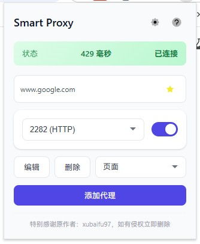
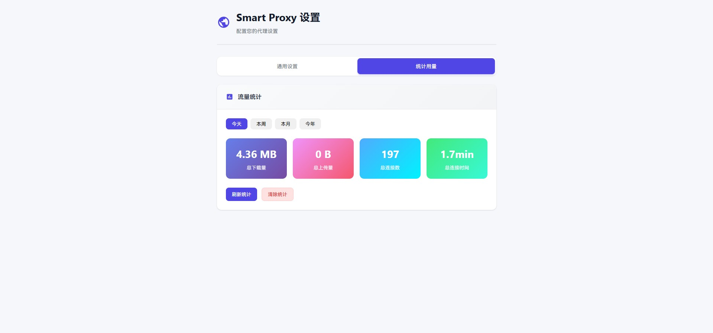

# Smart Proxy

一款功能强大的浏览器代理管理扩展，帮助您高效管理代理配置。

## 主要功能

- **快速切换代理**：一键切换不同的代理服务器
- **延迟测试**：实时显示代理延迟（毫秒）
- **网站收藏**：收藏网站，下次访问自动启用代理
- **多种代理模式**：
  - 页面模式：仅代理当前标签页的域名
  - 全局模式：代理所有流量
  - 规则模式：仅代理预设的不可访问域名和收藏域名
- **级联代理**：从已代理的标签页打开的新标签页也会自动代理
- **多语言支持**：支持中文、英文、日文、韩文、法文、德文、西班牙文等8种语言
- **代理认证**：支持HTTP、HTTPS、SOCKS4、SOCKS5代理，支持用户名/密码认证

## 界面预览

| 弹出窗口 | 设置页面 | 统计页面 |
|:---:|:---:|:---:|
|  |  |  |

## 安装方法

1. 下载或克隆本项目
2. 打开Chrome浏览器，进入扩展管理页面：`chrome://extensions/`
3. 开启"开发者模式"
4. 点击"加载已解压的扩展程序"
5. 选择本项目的 `smart-proxy` 目录

## 使用说明

1. 点击浏览器工具栏中的扩展图标打开弹出窗口
2. 点击"添加代理"按钮添加代理服务器
3. 从下拉框选择要使用的代理
4. 打开旁边的开关即可启用代理
5. 状态栏会显示当前连接延迟（毫秒）

## 快捷键

- Windows/Linux: `Ctrl+Shift+P`
- macOS: `Command+Shift+P`

## 打包构建

### 使用打包脚本

```bash
# 打包当前版本
./build.sh

# 打包指定版本
./build.sh 1.0.1
```

打包后的文件会在 `dist/` 目录中生成。

### 手动打包

```bash
zip -r smart-proxy.zip . \
  -x "./build.sh" \
  -x "./.gitignore" \
  -x "./README.md" \
  -x "./package.json" \
  -x "./package-lock.json" \
  -x "./babel.config.js" \
  -x "./node_modules/*" \
  -x "./tests/*" \
  -x "./dist/*"
```

## 提交到Chrome网上应用店

1. 注册 [Chrome网上应用店开发者账号](https://chrome.google.com/webstore/devconsole)（需支付 $5 USD）
2. 登录 [Chrome开发者控制台](https://chrome.google.com/webstore/devconsole)
3. 点击 "New Item" 上传打包好的 `.zip` 文件
4. 填写扩展信息、截图、隐私政策等
5. 提交审核（通常1-3个工作日）

## 项目结构

```
smart-proxy/
├── _locales/          # 多语言翻译文件
├── icons/             # 扩展图标
├── tests/             # 测试文件
├── background.js      # 后台脚本
├── popup.html/js/css  # 弹出窗口
├── options.html/js/css # 设置页面
├── help.html/js       # 帮助页面
└── manifest.json      # 扩展配置文件
```

## 许可证

本项目基于原作者 [xubaifu97](https://github.com/xubaifu97) 的 [Easy Proxy Switcher](https://chromewebstore.google.com/detail/fjnpcbjdpbhbdlnkncaoennjdkoegmof) 扩展进行优化改进。
